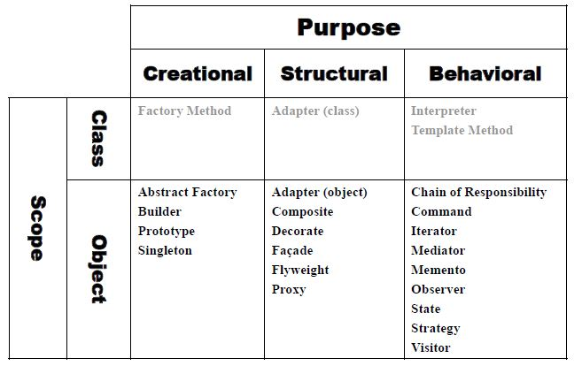

# 디자인 패턴

## 디자인 패턴이란?

- GoF( Gang of Four) 네 명의 학자가 기존의 많은 사례와 시스템등을 분석하여 좋은 설계라는 이런것이다 라는 23개 패턴을 제안

- 기존의 여러 시스템과 서비스를 기반으로 객체지향 프로그래밍에서 보다 유연하고, 확장성있는 설계가 가능한 예시를 제시

-  Each pattern describes a problem which occurs over and over again in our environment, 
  and then describes the core of the solution to that problem, in such a way 
  that you can use this solution a million times over, without ever doing it the same time twice.”
   - Christopher Alexander

## 객체지향 프로그래밍 

- 추상화, 캡슐화, 상속, 다형성

## 객체 지향 디자인 원칙 (Object Oriented Design Principle)

- 애플리케이션의 달라지는 부분을 찾아내고, 달라지지 않는 부분과 분리한다.
 새로운 요구사항이 있을때 마다 달라지는 부분은 분리해야 함

- 구현보다는 인터페이스에 맞춰서 프로그래밍 한다.
(Proram to an interface not an implementaion.)

- 상속보다는 합성을 사용한다. 
(Favor object composition over class inheritance.)

- Abstract class vs. Concrete class

- Class Inheritance vs. Object composition

- Interface Inheritance vs. Implementation Inheritance Etc...

## SOLID 원칙

- 단일 책임의 원칙 (Single Responsibility Principle)
    하나의 클래스는 하나의 기능만을 구현하도록 한다. 즉, 어떤 클래스를 변경하는 이유는 하나이어야  한다
    한 클래스에서 여러 기능을 제공하게 되면 유지보수가 어려움

- 개방 폐쇄의 원칙 (Open-Closed Principle)

    객체 자신의 수정에 대해서는 유연하고, 다른 클래스가 수정될 때는 영향을 받지 않는다.

    인터페이스나 추상클래스를 통해 접근 하도록 함
  
- 리스코프 치환 원칙 (Liskov Subsititution Principle)

    하위 클래스는 항상 상위 클래스로 교체 될 수 있어야 한다.

    즉, 상위 클래스에 제공되는 여러 기능은 하위 클래스가 모두 사용가능 해야 한다.
    
    IS-A 관게, "is a kind of" 관계

- 의전 역전 원칙 (Dependency Inversion Principle)

    의존 관계는 구체적인 것보다는 추상적인 것에 의존한다.

    구체적인 것은 이미 구현이 되어있고 변하기 쉬운것

    추상적인 것은 인터페이스나 추상 클래스(상위 클래스)

- 인터페이스 분리 원칙 (Interface Segregation Principle)
  
    제공하는 기능에 대한 인터페이스에만 종속적이어야 함

    만약 하나의 객체가 여러 기능을 제공해야 한다면 ( 단일 책임 원칙에 위배 ) 이때 클라이언트가  
    사용할 수 있는 여러 인터페이스로 분리하여 제공하면 클라이언트가 사용하지 않는 기능에 
    종속적이지 않을 수 있음

## 디자인 패턴은 규칙이 아닙니다. 

- 언어에 종속적이지 않음

- 프레임 워크 개발에 적용될 수 있음

- 특정 영역에 종속적이지 않고 일반적으로 활용할 수 있음

- 좋은 설계에 대한 제안

## 왜 학습 하는가?

- 객체 지향을 위한 디자인 패턴은 소프트웨에의 중요한 요소 (resuse, flexibility, extensibility, modularity) 를 향상 시킴

- 소프트웨어 개발의 communication에 도움이 됨

- 좋은 설계는 좋은 소프트웨어나 오픈소스에 대해 학습하거나, 많은 경험과 연습에 의해 훈련될 수 있기에 디자인 패턴을 공부함으로써 이미 증명된 스킬과 경험을 배울수 있음

- 높은 결합도를 가지거나 알고리즘 종속성, 객체의 표현이나 구현에 종속적으로 구현된 소프트웨어의 리펙토링을 가능하게 함

- 결국 좋은 설계를 유도하여 소프트웨어의 유지보수에 들어가는 비용을 절약할 수 있음

## 23개 디자인 패턴들...

