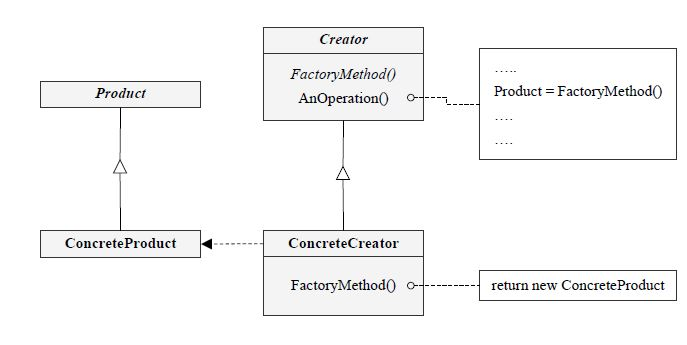

# Factory Method

## 디자인 원리
  " 구체적인 것에 의존하지 말고 추상적인 것에 의존한다" 
  
  - 객체 생성에 new 를 사용하여 구체 클래스 인스턴스를 생성하게 되면 
  대상의 인스턴스가 변경되었을 때 프로그램이 수정되어야 함

  예) Car car = new Car("Sonata");  // 차종에 따라 여러 차가 생성될 수 있음

  - 여러 인스턴스가 다양하게 생성될 수 있는 상황에서는 팩토리 메서드를 사용한다.

  - 생성될 수 있는 여러 객체를 추상화 하고, 팩토리에서는 추상 클래스를 활용하고 생성하는 메서드를 제공한다. 클라이언트는 실제 인스턴스와 상관없이, 팩토리가 제공해주는 생성 메서드 (에를 들얼 createCar())를 사용하면 된다. 구체적인 클래스에 종속되지 않음

## 이전의 코드 ( 구체적인 클래스 기반의 코드 )

Car.java
```
package factory.before;

public  class Car {

	public static final String SONATA = "Sonata";
	public static final String GRANDEUR = "Grandeur";
	public static final String GENESIS = "Genesis";
	
	String productName;
	
	public Car(String productName) {
		this.productName = productName;
	}
	
	public String toString() {
		return productName;
	}
}
```

CarTest.java (클라이언트 코드)
```
public class CarTest {
	
	public static void main(String[] args) {
		
		CarTest test = new CarTest();
		Car car = test.produceCar("Sonata");
			
		System.out.println(car);
	}
	
	public Car produceCar(String name) {
	
		Car car = null;
		
		if( name.equalsIgnoreCase(Car.SONATA)) {
			car = new Car(Car.SONATA);
		}
		else if( name.equalsIgnoreCase(Car.GRANDEUR)) {
			car = new Car(Car.GRANDEUR);
		}
		else if( name.equalsIgnoreCase(Car.GENESIS)) {
			car = new Car(Car.GENESIS);
		}
		else {
			car = new Car("noname");
		}
		
		return car;
	}
}
```

## 간단한 팩토리


## 여러가지 팩토리




- 상위 클래스에서 추상 팩토리 메서드를 제공하고 하위 클래스에서 이를 구현하여 구체 클래스를 생성한다. 따라서 클라이언트가 
사용하게 되는 상위 메서드는 추상화되어 있고, 실제 객체가 생성되는 하위 클래스와 분리되어 유연성이 제공된다.
