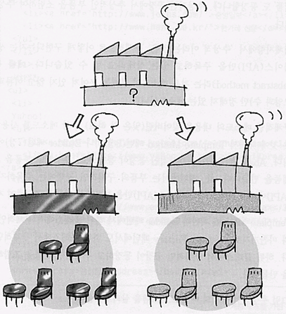

# Abstract Factory Method

## 디자인 원리

- 서로 연관성이 있는 여러 인스턴스를 한꺼번에 생성하기 위한 팩토리 패턴

- 추상화된 인터페이스를 팩토리에 제공하고 상황에 따라 그에 맞는 인스턴스들이 생성되도록 한다.

  가령 데이터베이스에 따라 DAO클래스가 달라져야 한다고 할 때, 현재 사용해야 하는 DB의 종류에 따른 DAO 인스턴스를 한꺼번에 생성하도록 한다.

위젯을 생성하여 보여줄 때 선택한 옵션에 따라 위젯의 set이 달라질 수 있도록 한다.

- 다양한 세트가 존재하고 이를 대체할 수 있도록 구현한 패턴

