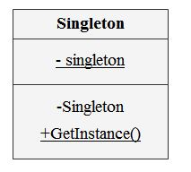

# Singleton

## 디자인 원리

- 클래스의 인스턴스가 오직 하나만이 존재해야 하고, 이에 대한 접근도 동일한 인터페이스를 통해 가능

- 인스턴스가 여러 개가 되면 오류가 생길 수 있고, 불필요한 자원들이 생성되고, 일관성이 없어지는 일이 발생하는 경우
 (Calendar, Logger, Connection pool,  학교 등등...)

- 전역 변수를 쓰는 것은 안 좋은 프로그래밍 방법 

- 자바에서는 static을 활용함

## Class Diagram




## 예제

Singleton.java
```
public class Singleton {

	private static Singleton instance;
	
	private Singleton() {
		
	}
	
	public static Singleton getInstance() {
		if(instance == null) {
			instance = new Singleton();
		}
		return instance;
	}
}
```

SingletonTest.java
```
public class SingletonTest {

	public static void main(String[] args) {

		Singleton instanceA = Singleton.getInstance();
		Singleton instanceB = Singleton.getInstance();
		
		System.out.println(instanceA == instanceB);
	}

}
```

## 언제 사용하는 것이 좋은가?
