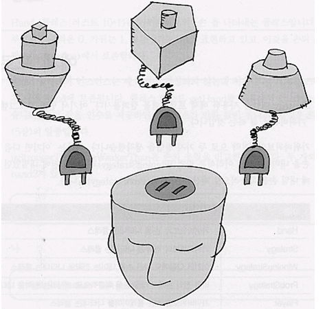

# Strategy

## 디자인 의도

- 다양한 기능과 알고리즘이 조건에 따라 상황에 따라 적용되어야 하는 경우

- 여러 클래스에 알고리즘이 적용되어야할 때 각각 구현하게 되면 낭비이고, 한꺼번에 구현하면 수정하기 어렵다.

- 인터페이스로 분리하고 적절한 기능이 적용될 수 있도록 하여 실제 사용하는 쪽과 알고리즘의 적용이 분리되도록 한다.

- 실행중에 선택될 수 있고, UI나 로직의 조건에 따라 다른 기능이 적용될 수 있는 유연함을 가진다. 

