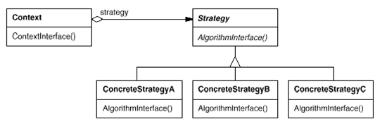

# Strategy

## 디자인 의도

- 다양한 기능과 알고리즘이 조건에 따라 상황에 따라 적용되어야 하는 경우

- 여러 클래스에 정책(알고리즘)이 적용되어야할 때 각각 구현하게 되면 낭비이고, 한꺼번에 구현하면 수정하기 어렵다.

- 인터페이스로 분리하고 적절한 기능이 적용될 수 있도록 하여 실제 사용하는 쪽과 알고리즘의 적용이 분리되도록 한다.

- 실행중에 선택될 수 있고, UI나 로직의 조건에 따라 다른 기능이 적용될 수 있는 유연함을 가진다. 

- 인터페이스에 선언된 기능을 구현한 다양한 정책이 다른 클래스들에 영향을 주지 않고 추가, 삭제될 수 있으므로 유지보수가 용이하다.


## 클래스 다이어그램



## 예제

   학교의 학생이 수강 신청을 하게되면 과목마다 각각 성적을 받게 된다. 이때, 성적에 대한 학점을 부여하는 정책은 다음과 같이 여러가지가 있을 수 있다. 
   전공 관련 여부에 따라 학점이 다르게 부여되는 경우, Pass/Fail로 만 학점을 부여하는 경우등 다양한 학점에 대한 정책이 있을때 각 성적에 대해 다양한 정책을 어떻게 구현하면 좋을까?

   다음과 같은 조건 일 때 학생의 학점을 출력해보자

   전공 과목인 경우의 학점 부여 방식

   | S | A | B | C | D | F |
   | ------ | ------ | ------ | ------ | ------ | ------ |
   | 95~100점 | 90~94점 | 80~89점 | 70~79점 | 60~69점 | 60점 미만 |


   비전공 과목인 경우의 학점 부여 방식
   | A | B | C | D | F |
   | ------ | ------ | ------ | ------ | ------ |
   | 90~100점 | 80~89점 | 70~79점 | 55~69점 | 55점 미만 |


   | 이름 | 전공과목 | 국어 | 수학 | 영어 
   | ----- | ------ | ------ | ------ | ------ |
   | Kim | 수학 | 100 | 100 |  |
   | Lee | 국어 | 55 | 55 | 100
   
Subject.java
```
public class Subject {
	
	private String name;
	private int scorePoint;
	private boolean majorCode;
	
	public String getName() {
		return name;
	}
	public void setName(String name) {
		this.name = name;
	}
	public int getScorePoint() {
		return scorePoint;
	}
	public void setScorePoint(int scorePoint) {
		this.scorePoint = scorePoint;
	}
	public boolean isMajorCode() {
		return majorCode;
	}
	public void setMajorCode(boolean majorCode) {
		this.majorCode = majorCode;
	}
}
```

Student.java
```
public class Student {
	
	int studentID;
	String studentName;
	ArrayList<Subject> subjectList;
	
	public static final int BASIC = 0;
	public static final int MAJOR = 1;
	
	public Student(int studentID, String studentName){
		this.studentID = studentID;
		this.studentName = studentName;
		
		subjectList = new ArrayList<Subject>();
	}
	
	public void addSubject(String name, int score, boolean majorCode){
		Subject subject = new Subject();
		
		subject.setName(name);
		subject.setScorePoint(score);
		subject.setMajorCode(majorCode);
		subjectList.add(subject);
	}
	
	public void showGradeInfo() {
		
		GradeEvaluation[] gradeEvaluation = {new BasicEvaluation(), new MajorEvaluation()};
		
		for(Subject s : subjectList){
		
			String grade;
			int score = s.getScorePoint();
			if (s.isMajorCode() == true) {
				grade = gradeEvaluation[MAJOR].getGrade(score);
			}
			else {
				grade = gradeEvaluation[BASIC].getGrade(score);
			}
			System.out.println("학생 " + studentName + "의 " + s.getName() + " 과목 성적은 " + 
			        s.getScorePoint() + "점 이고, 학점은 " + grade +" 입니다.");
		
		}
	}
}
```

GradeEvaluation.java
```
public interface GradeEvaluation {
	public String getGrade(int point);
}
```

BasicEvaluation.java
```
public  class BasicEvaluation implements GradeEvaluation{

	@Override
	public String getGrade(int point) {
		String grade;
		
		if(point >=90 && point <=100)
			grade = "A";
		else if(point >=80 && point <=89)
			grade = "B";
		else if(point >=70 && point <=79)
			grade = "C";
		else if(point >=55 && point <=69)
			grade = "D";
		else
			grade = "F";
		return grade;
	}
}
```

MajorEvaluation.java
```
public class MajorEvaluation implements GradeEvaluation{

	@Override
	public String getGrade(int point) {
		String grade;
		if(point >=95 && point <=100)
			grade = "S";
		else if(point >=90 && point <=94)
			grade = new String("A");
		else if(point >=80 && point <=89)
			grade = "B";
		else if(point >=70 && point <=79)
			grade = "C";
		else if(point >=60 && point <=69)
			grade = "D";
		else
			grade = "F";
		return grade;
	}
}
```
StudentTest.java
```
public class StudentTest {

	public static void main(String[] args) {
		Student studentLee = new Student(1001, "Lee");
		
		studentLee.addSubject("국어", 100, false);
		studentLee.addSubject("수학", 100, true);
		
		
		Student studentKim = new Student(1002, "Kim");
		
		studentKim.addSubject("국어", 55, true);
		studentKim.addSubject("수학", 55, false);
		studentKim.addSubject("영어", 100, false);
		
		studentLee.showGradeInfo();
		System.out.println("======================================");
		studentKim.showGradeInfo();
	}
}
```


