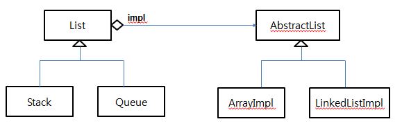

# Bridge

## 디자인 원리

- 기능(추상)의 계층과 구현의 계층을 분리하여 독립적으로 확장하도록 한다.

- 하나의 기능에 대한 다양한 구현이 적용될 수 있다.

- 기능과 구현부가 혼재하면 상속관계가 복잡해진다. 

- 분리하고 기능이 구현에 대한 참조를 가지게 하여 실제 구현을 선택할 수 있다. - Bridge

- 기능과 구현을 분리함으로써 낮은 결합도를 가지고, 기능이 구현에 종속되지 않는다.

- 실행 중에 구현부를 선택할 수 있고, 구현이 변경되더라구 기능에 대한 재컴파일이 필요없다. 

- 클라이언트는 기능 인터페이스를 사용하므로 구현에 대한 부분은 숨길 수 있다.

## 클래스 다이어그램 


## 프로그램 예제 

- List는 선형 자료의 추상적인 개념이고,  List 하위에 Stack 과 Queue라는 추상적인 개념이 추가 될 수 있음

- 실제 List는 Array와 LinkedList로 구현될 수 있음

- 따라서 하나의 Stack 이라는 기능은 Array, LinkedList 로 구현 가능함

- Bridge 패턴을 활용해보자 




List.java
```
public class List<T>{ 

	AbstractList<T> impl;
	
	public List(AbstractList<T> list) {
		impl = list;
	}
	
	public  void add(T obj) {
		impl.addElement(obj);
	}
	public  T get(int i) {
		return impl.getElement(i);
	}
	public  T remove(int i) {
		return impl.deleteElement(i);
	}
	public  int getSize() {
		return impl.getElementSize();
	}

}
```

Queue.java
```
import impl.AbstractList;

public class Queue<T> extends List<T> {

	public Queue(AbstractList<T> list) {
		super(list);
		System.out.println("Queue를 구현합니다.");
	}
	
	public void enQueue(T obj) {
		impl.addElement(obj);
	}
	
	public T deQueue() {
		return impl.deleteElement(0);
	}
	
}
```

Stack.java
```
public  class Stack<T> extends List<T> {
	
	public Stack(AbstractList<T> list) {
		super(list);
		System.out.println("Stack을 구현합니다.");
	}
	
	public void push(T obj) {
		impl.insertElement(obj, 0);
	}
	
	public T pop() {
		return impl.deleteElement(0);
	}

}
```

AbstractList.java
```
public interface AbstractList<T> {

	public void addElement(T obj);
	public T deleteElement(int i);
	public int insertElement(T obj, int i);
	public T getElement(int i);
	public int getElementSize();
}
```

ArrayImpl.java
```
public class ArrayImpl<T> implements AbstractList<T> {

	ArrayList<T> array;
	public ArrayImpl(){
		array = new ArrayList<T>();
		System.out.println("Array로 구현합니다.");
		
	}
	
	@Override
	public void addElement(T obj) {
		array.add(obj);
	}

	@Override
	public T deleteElement(int i) {
		
		return array.remove(i);
	}

	@Override
	public int insertElement(T obj, int i) {
		array.add(i, obj);
		return i;
	}

	@Override
	public int getElementSize() {
		return array.size();
	}

	@Override
	public T getElement(int i) {
		
		return array.get(i);
	}
}
```

LinkedListImpl.java
```
public class LinkedListImpl<T> implements AbstractList<T>{

	LinkedList<T> linkedList;
	
	public LinkedListImpl() {
		linkedList = new LinkedList<T>();
		System.out.println("LinkedList로 구현합니다.");
	}
	
	@Override
	public void addElement(T obj) {
		linkedList.add(obj);
		
	}

	@Override
	public T deleteElement(int i) {
		return linkedList.remove(i);
	}

	@Override
	public int insertElement(T obj, int i) {
		linkedList.add(i, obj);
		return i;
	}

	@Override
	public int getElementSize() {
		return linkedList.size();
	}

	@Override
	public T getElement(int i) {
		return linkedList.get(i);
	}

}
```

BridgeTest.java
```
public class BridgeTest {

	public static void main(String[] args) {

		Queue<String> arrayQueue = new Queue<String>(new ArrayImpl<String>());
		
		arrayQueue.enQueue("aaa");
		arrayQueue.enQueue("bbb");
		arrayQueue.enQueue("ccc");
		
		System.out.println(arrayQueue.deQueue());
		System.out.println(arrayQueue.deQueue());
		System.out.println(arrayQueue.deQueue());
		System.out.println("=========================");
		
		Queue<String> linkedQueue = new Queue<String>(new LinkedListImpl<String>());
		linkedQueue.enQueue("aaa");
		linkedQueue.enQueue("bbb");
		linkedQueue.enQueue("ccc");
		
		System.out.println(linkedQueue.deQueue());
		System.out.println(linkedQueue.deQueue());
		System.out.println(linkedQueue.deQueue());
		System.out.println("=========================");
		
		Stack<String> arrayStack = new Stack<String>(new ArrayImpl<String>());
		arrayStack.push("aaa");
		arrayStack.push("bbb");
		arrayStack.push("ccc");
		
		System.out.println(arrayStack.pop());
		System.out.println(arrayStack.pop());
		System.out.println(arrayStack.pop());
		System.out.println("=========================");
		
		Stack<String> linkedStack = new Stack<String>(new LinkedListImpl<String>());
		linkedStack.push("aaa");
		linkedStack.push("bbb");
		linkedStack.push("ccc");
		
		System.out.println(linkedStack.pop());
		System.out.println(linkedStack.pop());
		System.out.println(linkedStack.pop());
		System.out.println("=========================");
	}

}
```
