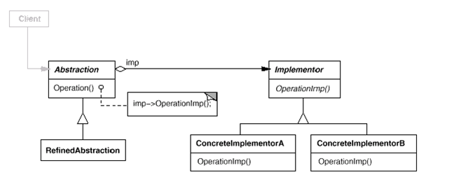

# Bridge

## 디자인 원리

- 기능(추상)의 계층과 구현의 계층을 분리하여 독립적으로 확장하도록 한다.

- 하나의 기능에 대한 다양한 구현이 적용될 수 있다.

- 기능과 구현부가 혼재하면 상속관계가 복잡해진다. 

- 분리하고 기능이 구현에 대한 참조를 가지게 하여 실제 구현을 선택할 수 있다. - Bridge

## 클래스 다이어그램 

