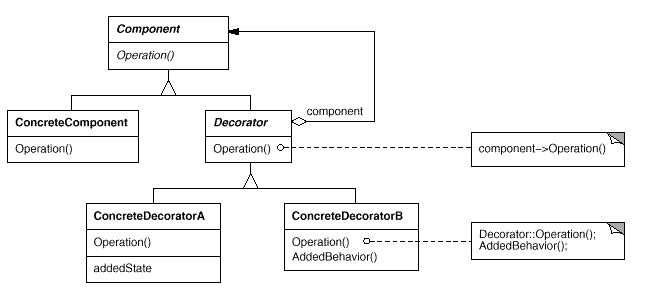

# Decorator

## 디자인 원리

- 상속을 하지 않고도 확장성 있게 클래스를 설계

- 상속은 클래스간의 종속성이 높아짐

- 다양한 기능을 추가하거나 삭제할때 사용하면 유용함 

    OCP (Open-Closed Priciple) 
    
    클래스는 확장에는 열려 있어야 하지만 변경에는 닫혀 있어야 한다.

## Class Diagram

