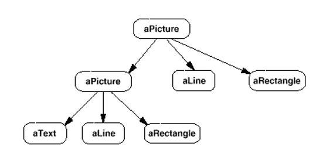
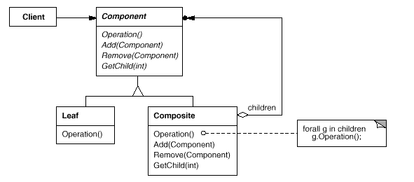

# Composite

## 디자인 원리

- 클라이언트가 복합 객체와 단일 객체를 동일하게 취급할 수 있음 (그릇과 내용물을 동일 시)


- 트리 구조일 때 많이 사용 됨 

- 재귀적인 구조

- 복합 객체와 단일 객체에 공통으로 사용하는 인터페이스를 선언

- 복합 객체가 객체들을 관리하기 위해 필요한 기능 선언

- 기본 객체는 복합 객체에 포함이 되고, 복합 객체 역시 또 다른 복합 객체에 포함될 수 있다.

- 복합 객체와 단일 객체에 대해 if 나 instanceof 와 같은 구문을 사용하지 않고 구현할 수 있음

- 기본 객체가 증가하여도 전체 객체의 코드에 영향을 주지 않는다.




## 클래스 다이어그램



# 예제 - 카테고리와 상품에 대한 예제

ProductCategory.java
```
public abstract class ProductCategory {
	int id;
	String name;
	int price;
	
	public ProductCategory(int id, String name, int price) {
		this.id = id;
		this.name = name;
		this.price = price;
	}
	
	public abstract void addProduct(ProductCategory product);
	public abstract void removeProduct(ProductCategory product);
	public abstract int getCount();
	public abstract String getName();
	public abstract int getPrice();
	public abstract int getId();

}
```

Category.java
```
public class Category extends ProductCategory{

	ArrayList<ProductCategory> list;
	
	public Category(int id, String name, int price) {
		super(id, name, price);
		list = new ArrayList<ProductCategory>();
	}

	@Override
	public void addProduct(ProductCategory productCategory) {
		list.add(productCategory);
	}

	@Override
	public void removeProduct(ProductCategory productCategory) {
		
		for(ProductCategory temp : list) {
			if(temp.getId() == productCategory.getId()) {
				list.remove(temp);
				return;
			}
		}
		System.out.println("카테고리가 없습니다.");
	}

	@Override
	public int getCount() {
		int count = 0;
		
		for(ProductCategory temp : list) {
			count += temp.getCount(); 
		}	
		return count;
	}

	@Override
	public String getName() {
		return list.toString();
	}

	@Override
	public int getPrice() {
		int price = 0;
		
		for(ProductCategory temp : list) {
			price += temp.getPrice(); 
		}
		
		return price;
	}

	@Override
	public int getId() {
		return 0;
	}

}
```

Product.java
```
public class Product extends ProductCategory{

	public Product(int id, String name, int price) {
		super(id, name, price);
	}
	
	@Override
	public int getCount() {
		return 1;
	}

	@Override
	public String getName() {
		return name;
	}

	@Override
	public int getPrice() {
		return price;
	}

	@Override
	public int getId() {
		return id;
	}
	
	@Override
	public void addProduct(ProductCategory product) {
		
	}

	@Override
	public void removeProduct(ProductCategory product) {
		
	}

}
```

CategoryClient.java
```
public class CategoryClient {

	public static void main(String[] args) {
		ProductCategory womanCategory = new Category(1234, "Woman", 0);
		ProductCategory manCategory = new Category(5678, "Man", 0);
		
		ProductCategory clothesCategoryW = new Category(2345, "Clothes", 0);
		ProductCategory bagCategoryW = new Category(3456, "Bag", 0);
		ProductCategory shoesCategoryW = new Category(9876, "Shoes", 0);
		
		womanCategory.addProduct(clothesCategoryW);
		womanCategory.addProduct(bagCategoryW);
		womanCategory.addProduct(shoesCategoryW);
		
		ProductCategory clothesCategoryM = new Category(23450, "Clothes", 0);
		ProductCategory bagCategoryM = new Category(34560, "Bag", 0);
		ProductCategory shoesCategoryM = new Category(98760, "Shoes", 0);
		
		manCategory.addProduct(clothesCategoryM);
		manCategory.addProduct(bagCategoryM);
		manCategory.addProduct(shoesCategoryM);
		
		ProductCategory shoes1 = new Product(121, "Nike", 100000);
		ProductCategory shoes2 = new Product(122, "ADIDAS", 200000);
		ProductCategory shoes3 = new Product(123, "GUCCI", 300000);
		ProductCategory shoes4 = new Product(124, "BALENCIA", 400000);
		ProductCategory shoes5 = new Product(125, "PRADA", 500000);
		ProductCategory shoes6 = new Product(126, "BALLY", 600000);
		
		shoesCategoryW.addProduct(shoes1);
		shoesCategoryW.addProduct(shoes2);
		shoesCategoryW.addProduct(shoes3);
		
		shoesCategoryM.addProduct(shoes4);
		shoesCategoryM.addProduct(shoes5);
		shoesCategoryM.addProduct(shoes6);
		
		
		ProductCategory bag1 = new Product(121, "HERMES", 500000);
		ProductCategory bag2 = new Product(122, "LOUISVUITTON", 500000);
		ProductCategory bag3 = new Product(123, "GUCCI", 500000);
		ProductCategory bag4 = new Product(124, "BALENCIA", 500000);
		ProductCategory bag5 = new Product(125, "PRADA", 500000);
		ProductCategory bag6 = new Product(126, "MULBERRY", 500000);
		
		bagCategoryW.addProduct(bag1);
		bagCategoryW.addProduct(bag2);
		bagCategoryW.addProduct(bag3);
		
		bagCategoryM.addProduct(bag4);
		bagCategoryM.addProduct(bag5);
		bagCategoryM.addProduct(bag6);
		
		System.out.println(womanCategory.getCount());
		System.out.println(womanCategory.getPrice());
		System.out.println(manCategory.getCount());
		System.out.println(manCategory.getPrice());

	}

}
```


