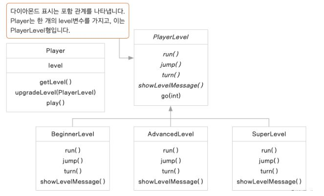

# State

## 디자인 원리

- 클래스의 하나의 상태에 따라 그 내부의 메서드 기능들이 바뀐다면 상태를 캡슐화 하여 처리한다.

- 객체의 기능은 상태에 따라 달라질 수 있는데, 이러한 상태가 여러가지이고, 클래스 전반의 모든 기능이 상태에 의존적이라 하면, 상태를 클래스로 표현하는 것이 적절함
   
- 너무 많은 if-else if문 : 클래스로 분리하지 않게 되면 상태가 여러가지인 경우 많은 if-else if문이 사용되고 추후 상태가 추가되거나 삭제될 때 수정해야 하는 사항이 너무 많아짐

## 이전 코드

Player.java
```
public class Player {

	public static final int BEGINNER_LEVEL = 1;
	public static final int ADVANCED_LEVEL = 2;
	public static final int SUPER_LEVEL = 3;

	int level;
	
	public Player() {
		level = BEGINNER_LEVEL;
	}
	
	public void jump() {
		
		if(level == BEGINNER_LEVEL) {
			System.out.println("Jump 할 줄 모르지롱.");
		}
		else if(level == ADVANCED_LEVEL) {
			System.out.println("높이 jump 합니다.");
		}
		else if(level == SUPER_LEVEL) {
			System.out.println("아주 높이 jump 합니다.");
		}
	}
	
	public void run() {
		if(level == BEGINNER_LEVEL) {
			System.out.println("천천히 달립니다.");
		}
		else if(level == ADVANCED_LEVEL) {
			System.out.println("빨리 달립니다.");
		}
		else if(level == SUPER_LEVEL) {
			System.out.println("엄청 빨리 달립니다.");
		}
		
	}
	
	public void turn() {
		if(level == BEGINNER_LEVEL) {
			System.out.println("Turn 할 줄 모르지롱.");
		}
		else if(level == ADVANCED_LEVEL) {
			System.out.println("Turn 할 줄 모르지롱.");
		}
		else if(level == SUPER_LEVEL) {
			System.out.println("한 바퀴 돕니다.");	
		}
		
	}
	
	public void play(int time) {
				
		run();
		for(int i =0; i<time; i++) {
			jump();	
		}
		turn();
	}

	public void upgradeLevel(int level) {
		this.level = level;
	}
}
```
MainBoard.java
```
public class MainBoard {

	public static void main(String[] args) {
	
		Player player = new Player();
		player.play(1);
		player.upgradeLevel(Player.ADVANCED_LEVEL);		
		player.play(2);
		player.upgradeLevel(Player.SUPER_LEVEL);		
		player.play(3);

	}
}
```

## State Pattern을 활용한 리펙토링



PlayerLevel.java
```
public abstract class PlayerLevel {

	public abstract void run();
	public abstract void jump();
	public abstract void turn();
	public abstract void showLevelMessage();
	
	final public void go(int count)
	{
		run();
		for(int i=0; i<count; i++){
			jump();
		}
		turn();
	}

}
```
BeginnerLevel.java
```
public class BeginnerLevel extends PlayerLevel{

	@Override
	public void run() {
		System.out.println("천천히 달립니다.");
	}

	@Override
	public void jump() {
		System.out.println("Jump 할 줄 모르지롱.");
	}

	@Override
	public void turn() {
		System.out.println("Turn 할 줄 모르지롱.");	
	}

	@Override
	public void showLevelMessage() {
		System.out.println("***** 초보자 레벨 입니다. *****");
	}
}
```
AdvancedLevel.java
```
public class AdvancedLevel extends PlayerLevel{

	@Override
	public void run() {
		System.out.println("빨리 달립니다.");
	}

	@Override
	public void jump() {
		System.out.println("높이 jump 합니다.");
	}

	@Override
	public void turn() {
		System.out.println("Turn 할 줄 모르지롱.");
	}

	@Override
	public void showLevelMessage() {
		System.out.println("***** 중급자 레벨 입니다. *****");
	}

}
```
SuperLevel.java
```
public class SuperLevel extends PlayerLevel{

	@Override
	public void run() {
		System.out.println("엄청 빨리 달립니다.");
	}

	@Override
	public void jump() {
		System.out.println("아주 높이 jump 합니다.");
	}

	@Override
	public void turn() {
		System.out.println("한 바퀴 돕니다.");	
	}

	@Override
	public void showLevelMessage() {
		System.out.println("***** 고급자 레벨 입니다. *****");
	}

}
```
Player.java
```
public class Player {

	private PlayerLevel level;
	
	public Player()
	{
		level= new BeginnerLevel();
		level.showLevelMessage();
	}

	public PlayerLevel getLevel() {
		return level;
	}

	public void upgradeLevel(PlayerLevel level) {
		this.level = level;
		level.showLevelMessage();
	}
	
	public void play(int count){
		level.go(count);
	}
}
```
MainBoard.java
```
public class MainBoard {

	public static void main(String[] args) {
	
		Player player = new Player();
		player.play(1);
		AdvancedLevel aLevel = new AdvancedLevel();
		player.upgradeLevel(aLevel);
		player.play(2);
		SuperLevel sLevel = new SuperLevel();
		player.upgradeLevel(sLevel);
		player.play(3);

	}

}
```

## 중요한 결론 

- 상태에 따른 기능을 분리하여 구현

- 새로운 상태가 추가되면 새로운 클래스를 추가한다.

- 각 상태의 switch를 명확하게 구현해 함 


