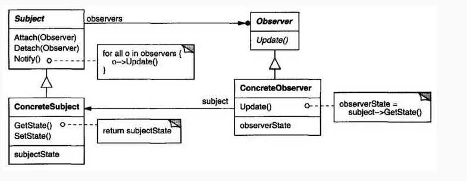

# Observer

## 디자인 원리

- "상호 작용하는 객체 사이에는 가능하면 느슨한 결합(Loose coupling)을 사용해야 한다"

- 객체 사이에 일대 다의 의존관계가 있고, 어떤 객체의 상태가 변화하면 그 객체에 의존성을 가진 다른 객체들에게 변화를 통지(notify  or update)하여 자동으로 갱신되게 한다.

- data(날씨, 통계)와 이것을 보여주는 여러 개의 view (그래프, 대시보드)

- Log의 내용을 기록하는 Handler가 파일, 콘솔등 여러개 일때

- 이때 중요한 건 그 변화에 관심이 있는 객체가 몇개인가와 상관 없이 통보될 수 있도록 구현해야 한다. 

- 변화하는 데이터 객체는 Subject, 이를 모니터링 하는 객체들은 Observer 라고 한다.

- Subject와 Observer를 분리하여 구현하면 Observer의 추가, 삭제, 변경등이 용이하다.

- 데이타는 Subject가 Push할 수도 있고, Observer에서 Pull 할 수도 있다.

## Class diagram

