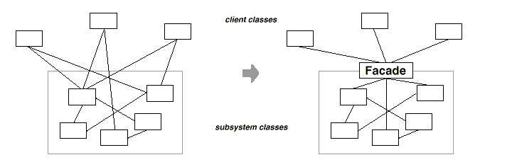
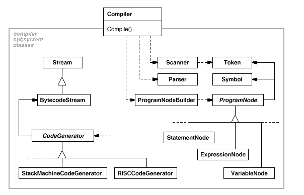

# Facade 

## 디자인 원리

- 간단한 창구

- 서브시스템이 여러개인 경우 이를 통합한 하나의 인터페이스를 제공

- 서브시스템을 좀 더 편하게 이용하기 위한 높은 수준의 인터페이스를 정의 

- 각 서브시스템의 역할이나 의존관계를 내부에서 올바를 순서로 사용할 수 있도록 외부에는 간단한 인터페이스만을 오픈

- 클라이언트와 서브시스템간의 결합도를 줄임



- 컴파일러 예



- **최소 지식 원칙**  : 가장 친한 친구에게만 이야기 한다.

     객체가 서로 상호 작용하는 개수와 방식에 주의를 해야 함

     여러 클래스가 복잡하게 얽히지 않고 의존관계를 적게 해야 수정을 할때 side effect나 연관 수정이 발생하지 
     않음

- -  객체 자체

- -  메소드의 매개 변수로 전달된 객체

- -  메소드를 생성하거나 인스턴스를 만들 객체

- -  객체에 속하는 구성 요소

안 좋은 예
```
public float getTemp(){
     Thermometer thermometer = station.getThermometer();
     return thermometer.getTemperature();
}
```

좋은 예
```
public float getTemp(){
     return station.getTemperature();
}
```


