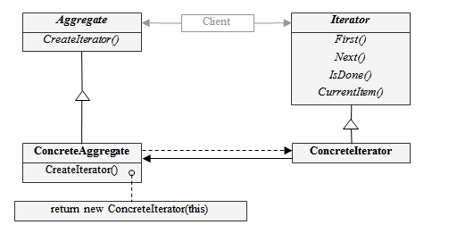

# Iterator

## 디자인 원리

- 객체의 내부 구현을 외부로 노출하지 않고 집합체(Aggregate)의 모든 항목에 대한 접근이 가능하게 설계

- 여러 리스트에 대해 동일한 방식으로 순회 할 수 있는 인터페이스와 기능을 제공

- 집합체는 순회에 대한 구현을 하지 않아도 됨

- **단일 역할의 원칙**
   
    어떤 클래스가 하나 이상의 역할을 제공하게 되면 변경이 되는 이유도 하나 이상이 된다.
    클래스가 변경되는 이유는 하나뿐이어야 한다.
    
    집합체가 순회에 대한 구현까지 한다면 집합체의 기능과 순회 두가지 기능을 가지게 되는 것

- java.util.Iterator



## 예제

- Iterator.java
```
public interface Iterator {
	public abstract boolean hasNext();
    public abstract Object next();
}
```

- Aggregate.java
```
public interface Aggregate {
	 public abstract Iterator iterator();
	 public int getLength();
}
```

- Book.java
```
public class Book {

	private String name;
	public Book(String name) {
		this.name = name;
	} 
	
	public String getName() {
		return name;
	}
}
```

- BookShelf.java
```
public class BookShelf implements Aggregate{

	private Book[] books;
	private int last = 0;
	
	public BookShelf(int maxSize) {
		books = new Book[maxSize];
	}
	
	public Book getBookAt(int index) {
		return books[index];
	}
	
	public void appendBook(Book book) {
		this.books[last] = book;
		last++;
	}
	
	@Override
	public Iterator iterator() {
		return new BookShelfIterator(this);
	}

	@Override
	public int getLength() {
		return last;
	}

}
```

- BookShelfIterator.java
```
public class BookShelfIterator implements Iterator{

	private BookShelf bookShelf;
	private int index;
	
	public BookShelfIterator(Aggregate bookShelf) {
		this.bookShelf = (BookShelf)bookShelf;
		this.index = 0;
	}
	
	@Override
	public boolean hasNext() {
		if(index < bookShelf.getLength()) {
			return true;
		}
		else return false;
	}

	@Override
	public Object next() {
		if(index < bookShelf.getLength()) {
			Book book =  bookShelf.getBookAt(index);
			index++;
			return book;
		}
		return null;
	}

}
```

- Main.java
```
public class Main {

	public static void main(String[] args) {
		BookShelf bookShelf = new BookShelf(4);
        bookShelf.appendBook(new Book("Around the World in 80 Days"));
        bookShelf.appendBook(new Book("Bible"));
        bookShelf.appendBook(new Book("Cinderella"));
        bookShelf.appendBook(new Book("Daddy-Long-Legs"));
        
        Iterator it = bookShelf.iterator();
        while (it.hasNext()) {
            Book book = (Book)it.next();
            System.out.println("" + book.getName());
        }
        
        System.out.println("============");
   
	}

}
```
