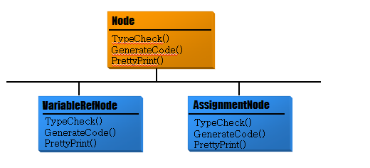
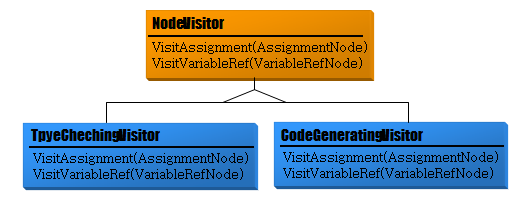
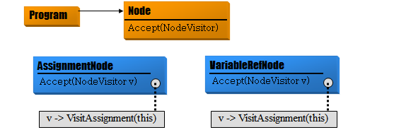
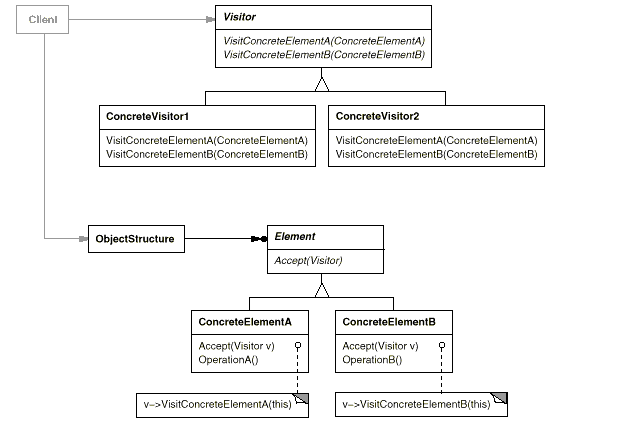

# Visitor

## 디자인 원리

- 클래스에 다양한 기능이 추가 되거나 삭제되는 일이 자주 일어나면 클래스를 자주 변경해야 하는 번거로움이 있다.

- 객체가 가지는 기능들을 클래스로 분리한다.

- 기능을 구현한 클래스를 Visitor라고 하고 각 객체는 이 Visitor를 accept 함으로써 기능이 수행된다. 

- 모든 클래스에 적용하기 위한 기능을 추가할 때는 각 클래스를 수정하지 않고 Visitor를 추가하면 되지만, 클래스의 캡슐화에 위배되는 구현 방식이므로 클래스의 캡슐화가 크게 중요하지 않는 경우에 적용해야 하는 패턴임 

- 따라서 클래스 구조의 변화는 거의 없고 기능의 추가 삭제가 자주 발생할때 사용하는것이 좋음

- 복합 객체인 경우 단일 객체와 동일한 기능이 구현될 때 이를 Visitor로 분리하고 Visitor가 각 객체를 순회하는 방식으로 사용할 수 있음

## 추상 구문 트리 예



- 문법적 처리를 위해 각 노드마다 수행해야 하는 기능을 따로 정의해야 함

- 유사한 오퍼레이션들이 여러 객체에 분산되어 있어서 디버깅이 어렵고 가독성이 떨어짐

- 각 클래스에서 유사한 오퍼레이션들을 클래스로 따로 모아 Visitor를 만든다.



- 각 노드 클래스는 visitor가 방문하면 accept 하여 해당 노드에 대한 기능이 수행되도록 함



## 클래스 다이어그램 



## 프로그램 예
Visitor.java
```
public abstract class Visitor {
    public abstract void visit(File file);
    public abstract void visit(Directory directory);
}
```

ListVisitor.java
```
public class ListVisitor extends Visitor {
    private String currentdir = "";                         // 현재 주목하고 있는 디렉토리명
   
    public void visit(File file) {                  // 파일을 방문했을 때 호출된다.
        System.out.println(currentdir + "/" + file);
    }
    
    public void visit(Directory directory) {   // 디렉토리를 방문했을 때 호출된다.
        System.out.println(currentdir + "/" + directory);
        String savedir = currentdir;
        currentdir = currentdir + "/" + directory.getName();
        Iterator<Entry> it = directory.iterator();
        while (it.hasNext()) {
            Entry entry = (Entry)it.next();
           // if(entry.getName() == "tmp")
           // 	continue;
            
            entry.accept(this);
            
        }
        currentdir = savedir;
    }
}
```

Acceptor.java
```
public interface Acceptor {
    public abstract void accept(Visitor v);
}
```

Entry.java
```
public abstract class Entry implements Acceptor {
    public abstract String getName();                                   // 이름을 얻는다.
    public abstract int getSize();                                      // 사이즈를 얻는다.
    public Entry add(Entry entry) throws FileTreatmentException {       // 엔트리를 추가
        throw new FileTreatmentException();
    }
    public Iterator iterator() throws FileTreatmentException {    // Iterator의 생성
        throw new FileTreatmentException();
    }
    public String toString() {                                          // 문자열 표현
        return getName() + " (" + getSize() + ")";
    }
}
```

File.java
```
public class File extends Entry {
    private String name;
    private int size;
    public File(String name, int size) {
        this.name = name;
        this.size = size;
    }
    public String getName() {
        return name;
    }
    public int getSize() {
        return size;
    }
    public void accept(Visitor v) {
        v.visit(this);
    }
}
```

Directory.java
```
public class Directory extends Entry {
    private String name;                    // 디렉토리의 이름
    private ArrayList<Entry> dir = new ArrayList<Entry>();      // 디렉토리 엔트리의 집합
    public Directory(String name) {         // 생성자
        this.name = name;
    }
    public String getName() {               // 이름을 얻는다.
        return name;
    }
    public int getSize() {                  // 사이즈를 얻는다.
        int size = 0;
        Iterator<Entry> it = dir.iterator();
        while (it.hasNext()) {
            Entry entry = (Entry)it.next();
            size += entry.getSize();
        }
        return size;
    }
    public Entry add(Entry entry) {         // 엔트리의 추가
        dir.add(entry);
        return this;
    }
    public Iterator<Entry> iterator() {      // Iterator의 생성
        return dir.iterator();
    }
    public void accept(Visitor v) {         // 방문자를 받아들임
        v.visit(this);
    }
}
```

Main.java
```
public class Main {
    public static void main(String[] args) {
        try {
            System.out.println("Making root entries...");
            Directory rootdir = new Directory("root");
            Directory bindir = new Directory("bin");
            Directory tmpdir = new Directory("tmp");
            Directory usrdir = new Directory("usr");
            rootdir.add(bindir);
            rootdir.add(tmpdir);
            rootdir.add(usrdir);
            bindir.add(new File("vi", 10000));
            bindir.add(new File("latex", 20000));
            rootdir.accept(new ListVisitor());              

            System.out.println("");
            System.out.println("Making user entries...");
            Directory Kim = new Directory("Kim");
            Directory Lee = new Directory("Lee");
            Directory Kang = new Directory("Kang");
            usrdir.add(Kim);
            usrdir.add(Lee);
            usrdir.add(Kang);
            Kim.add(new File("diary.html", 100));
            Kim.add(new File("Composite.java", 200));
            Lee.add(new File("memo.tex", 300));
            Kang.add(new File("game.doc", 400));
            Kang.add(new File("junk.mail", 500));
            rootdir.accept(new ListVisitor());             
        } catch (FileTreatmentException e) {
            e.printStackTrace();
        }
    }
}
```


FileTreatmentException.java
```
public class FileTreatmentException extends RuntimeException {
    public FileTreatmentException() {
    }
    public FileTreatmentException(String msg) {
        super(msg);
    }
}
```
