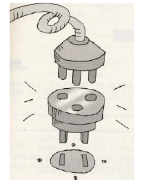
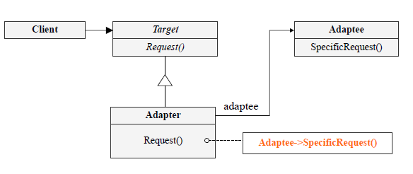
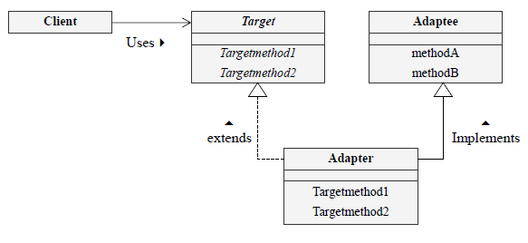

# Adapter

## 디자인 원리

- 서로 다른 인터페이스를 연결함

- 이미 사용중이거나 정의된 인터페이스를 변경하지 않고 기존에 사용하던 대로 사용할 수 있도록 Adapter 객체를 제공

- 클라이언트가 사용하던 방식대로 호출하여 사용할 수 있도록 조정해줌

- 예) 안드로이드의 ListView를 만들때 사용되는 Adapter - 실제 Item 과 View를 연결해주는 기능

안드로이드에서는 여러 View (ListView 나 GridView)를 구현할 때 이에 대한 Item들을 직접 View에 올리지 않고, 

Adapter를 이용하여 Adapter에서 Item을 관리하고 그리는 방식을 정하도록 한다. 

이 방법은 실제 보여주는 부분과 데이타를 분리하여 데이타가 다양한 방식의 View에 활용될 수 있고, 이 때 중간에서 사용되는 

여러 Adapter (BaseAdapter, ListAdapter)등이 데이터와 View를 연결해준다.



## 클래스 다이어그램

- 합성( composition )으로 구현하기




- 상속 ( inheritance )로 구현하기




## 예제 
- 인터페이스 ( Print.java )

```
public interface Print {
    public abstract void printWeak();
    public abstract void printStrong();
}
```

- 클라이언트 코드 (Main.java)

```
public class Main {
    public static void main(String[] args) {
        Print p = new PrintBanner("Hello");
        p.printWeak(); 
        p.printStrong();
    }
}
```


- 인터페이스 (Adaptee)


