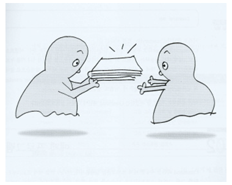
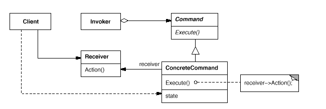
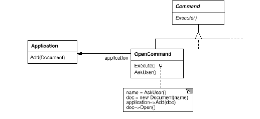
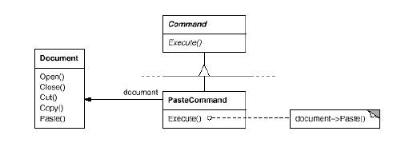
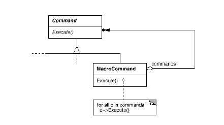

# Command

## 디자인 원리

- 다양하게 처리되야 하는 요청(명령, 기능)과 그 대상을 캡슐화(객체화)하여 모든 요청들을 같은 방식으로 처리가 가능하다.

- 요청을 보내는 쪽과 이를 처리는 하는 부분이 분리가 되어 서로 몰라도 됨

- 여러 다른 명령이 추가되더라도 일관성있게 처리될 수 있다.

- 요청을 기록으로 남겨서 취소할 수도 있고, 여러 개의 요청을 한꺼번에 처리할 수 있다.

- 명령을 실행하는데 있어서 부가적인 요소가 많아지면 비효율적일 수 있다. 

- 윈도우 프로그램에서 이벤트를 처리하기 위한 message queue는 Command 패턴과 유사한 방식이다.

- 메뉴나 메세지들을 처리할 때 Comman 패턴을 활용하면 유용하다.

- 여러 Command를 순차적으로 처리 하려면 배열에 커맨드를 넣어두었다가 순차적으로 수행하는 매크로 커맨드 방식을 활용할 수 있다.

## 클래스 다이어그램

예) 요리사(receiver), 주문서(command), 종업원(invoker)

## Menu 예

- 애플리케이션에 여러 메뉴가 있고, 각 메뉴의 기능은 각가 다른 대상을 가짐

- 사용자가 하나의 메뉴를 선택하면 연결되 Command의 서브클래스에서 excute() 메서드를 호출

- MenuItem과 실제 수행되는 대상과는 결합도가 약해짐 (MenuItem이 Document를 호출하지 않음)

- Command의 서브클래스가 수행할 객체에 대한 정보를 가지고 있음

- OpenCommand 

- PasteCommand

- Macro Command

## 프로그램 예

- 리모컨이나 메뉴등 명령을 발생하는 곳(invoker)이 있고 이 여러 메뉴들에 각각 다른 대상(receiver)에 대한 수행을 요구한다고 하면 이를 어떻게 처리할 것인가?

